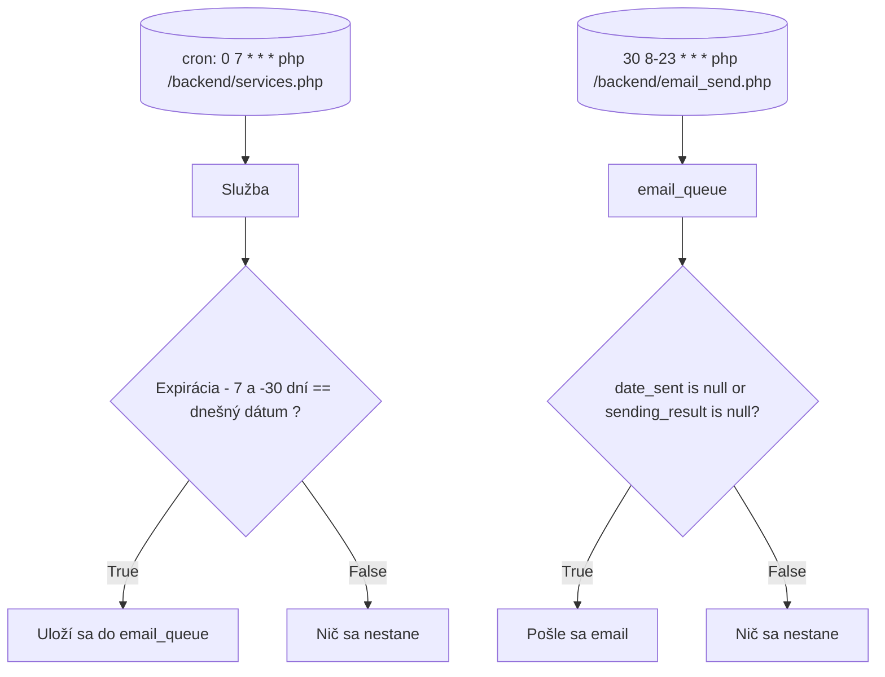

##Flow chart:

```mermaid

flowchart TD

X[(cron: 0 7 * * * php /backend/services.php)] -->

A[Služba] --> B{Expirácia - 7 a -30 dní == dnešný dátum ?}
B -- True --> E[Uloží sa do email_queue]
B -- False --> C[Nič sa nestane]

F[(30 8-23 * * * php /backend/email_send.php)]-->
G[email_queue]-->H{date_sent is null or sending_result is null?}
H--True-->I[Pošle sa email]
H--False-->K[Nič sa nestane]
```
