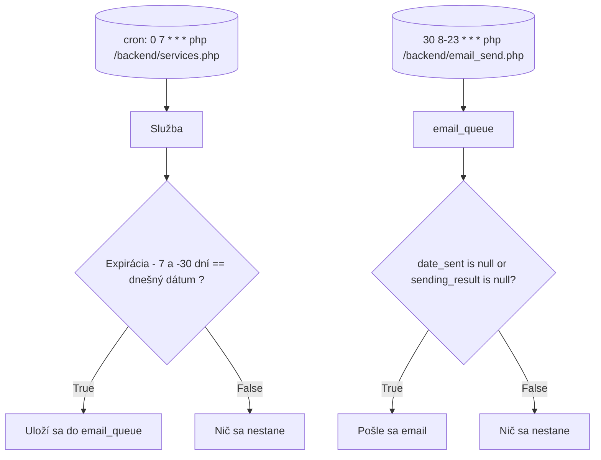

##Flow chart:

## Database Schema

### Table: Users

| Column   | Type    | Description               |
| -------- | ------- | ------------------------- |
| id       | INTEGER | User ID (Primary Key)     |
| username | VARCHAR | User's username           |
| password | VARCHAR | User's password           |
| date     | DATE    | Date of user registration |

### Table: Services

| Column             | Type    | Description                                            |
| ------------------ | ------- | ------------------------------------------------------ |
| id_service         | INTEGER | Service ID (Primary Key)                               |
| customer_name      | VARCHAR | Name of the customer                                   |
| customer_email     | VARCHAR | Email of the customer                                  |
| service_name       | VARCHAR | Name of the service                                    |
| service_expiration | DATE    | Date of service expiration                             |
| customer_answer    | BOOLEAN | Indicates whether the customer answered (1) or not (0) |

### Table: Queue

| Column         | Type     | Description                                                      |
| -------------- | -------- | ---------------------------------------------------------------- |
| id_queue       | INTEGER  | Queue ID (Primary Key)                                           |
| id_service     | INTEGER  | Service ID (Foreign Key)                                         |
| mail_subject   | VARCHAR  | Subject of the email                                             |
| mail_text      | TEXT     | Content of the email                                             |
| date_sent      | DATETIME | Date and time when the email was sent                            |
| sending_result | BOOLEAN  | Indicates whether the email was sent successfully (1) or not (0) |
