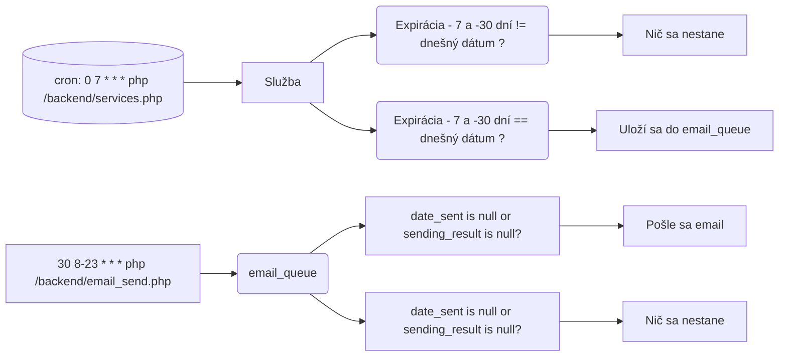

Flow chart:

```mermaid
graph LR
X[(cron: 0 7 * * * php /backend/services.php)] -->
A[Služba] --> B(Expirácia - 7 a -30 dní != dnešný dátum ?)
B --> C[Nič sa nestane]
A --> D(Expirácia - 7 a -30 dní == dnešný dátum ?)
D --> E[Uloží sa do email_queue]

F[30 8-23 * * * php /backend/email_send.php]-->G(email_queue)-->H[date_sent is null or sending_result is null?]-->I[Pošle sa email]
G-->J[date_sent is null or sending_result is null?]-->K[Nič sa nestane]
```
